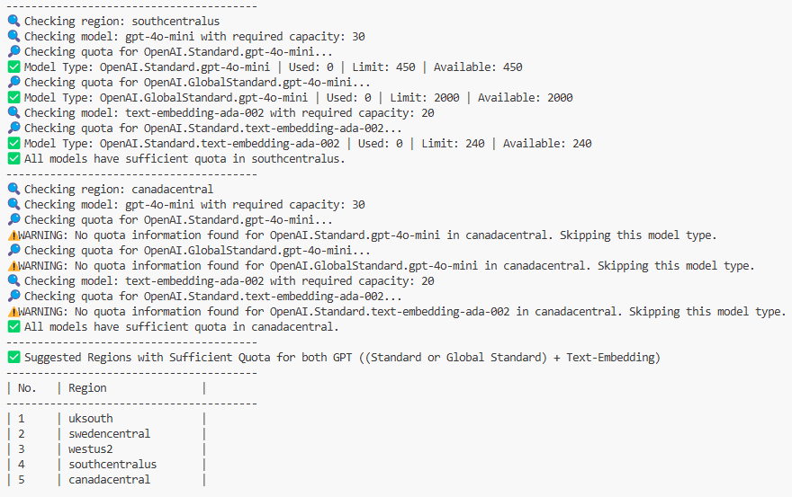

## Check Quota Availability Before Deployment

Before deploying the accelerator, **ensure sufficient quota availability** for the required model.  
Use one of the following scripts based on your needs:  

| Script                      | Use Case |
|-----------------------------|------------------------------------------------|
| **`quota_check_params.sh`**     | Check quota for **specific models & capacities** in a chosen region. |
| **`quota_check_all_regions.sh`** | Check **quota across all Azure regions** for default models. |

## Features
### **1️⃣ `quota_check_params.sh` - Check Specific Models & Regions**
✔️ You can pass the **model name and required capacity** in the format:  
```sh
gpt-4o-mini:30
```
✔️ **Multiple models** can be passed, separated by commas:  
```sh
gpt-4o-mini:30,text-embedding-ada-002:20
```
✔️ **Region is optional**:  
- If no region is provided, the script checks in the following **default regions**:  
  ```
  eastus, uksouth, eastus2, northcentralus, swedencentral, westus, westus2, southcentralus, canadacentral
  ```
- If you want to check a **specific region**, pass it as a parameter.
#### **Usage Examples**
- **Check multiple models in a specific region**:
  ```
  ./quota_check_params.sh gpt-4o-mini:30,text-embedding-ada-002:20 eastus
  ```
- **Check a single model without specifying a region** (uses default regions):
  ```
  ./quota_check_params.sh gpt-4o-mini:30
  ```
- **Check a single model in a specific region:**
  ```
  ./quota_check_params.sh gpt-4o-mini:30 eastus
  ```
#### **Sample Output**


### **2️⃣ `quota_check_all_regions.sh` - Check Across All Azure Regions**
✔️ No parameters required – it will automatically check quota availability in all Azure regions.

✔️ It checks quota for the following default models:

```sh
gpt-4o, gpt-4o-mini, text-embedding-ada-002, gpt-3.5-turbo, gpt-4
```
#### **Usage Examples:**
- **Check multiple regions for default models**:
  ```
  ./quota_check_all_regions.sh
  ```
#### **Sample Output**


---
## **If using Azure Portal and Cloud Shell**

1. Navigate to the [Azure Portal](https://portal.azure.com).
2. Click on **Azure Cloud Shell** in the top right navigation menu.
3. Run the appropriate command based on your requirement:  

   **To check quota for a specific model and capacity:**  

    ```sh
    curl -L -o quota_check_params.sh "https://raw.githubusercontent.com/microsoft/document-generation-solution-accelerator/main/scripts/quota_check_params.sh"
    chmod +x quota_check_params.sh
    ./quota_check_params.sh <model_name:capacity> [<model_region>] (e.g., gpt-4o-mini:30,text-embedding-ada-002:20 eastus)
    ```
     - Refer to [Usage Examples](#usage-examples) for detailed commands.

   **To check available quota across all regions for supported models:**  

    ```sh
    curl -L -o quota_check_all_regions.sh "https://raw.githubusercontent.com/microsoft/document-generation-solution-accelerator/main/scripts/quota_check_all_regions.sh"
    chmod +x quota_check_all_regions.sh
    ./quota_check_all_regions.sh
    ```
    - Refer to [Usage Examples](#usage-examples-1) for detailed commands.
    
## **If using VS Code or Codespaces**
1. Open the terminal in VS Code or Codespaces.  
2. Navigate to the `scripts` folder where the script files are located:
   ```sh
    cd scripts
    ```
3. Run the appropriate script based on your requirement:  

   **To check quota for a specific model and capacity:**  

    ```sh
    ./quota_check_params.sh <model_name:capacity> [<model_region>] (e.g., gpt-4o-mini:30,text-embedding-ada-002:20 eastus)
    ```
    - Refer to [Usage Examples](#usage-examples) for detailed commands.

   **To check available quota across all regions for supported models:**  

    ```sh
    ./quota_check_all_regions.sh
    ```
     - Refer to [Usage Examples](#usage-examples-1) for detailed commands.
4. If you see the error `_bash: az: command not found_`, install Azure CLI:  

    ```sh
    curl -sL https://aka.ms/InstallAzureCLIDeb | sudo bash
    az login
    ```
5. Rerun the script after installing Azure CLI.
